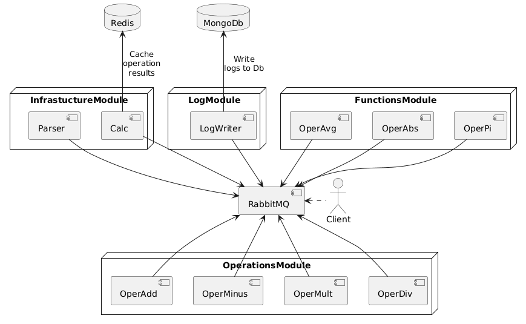
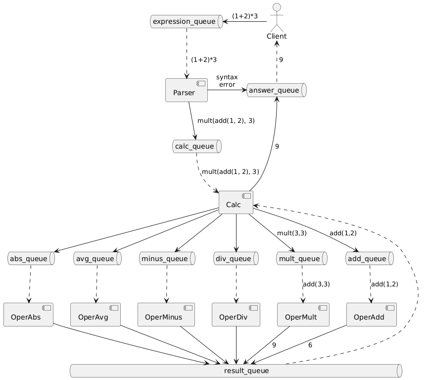

# Калькулятор на микросервисной архитектуре
## Откуда у проекта растут ноги
Мне всегда хотелось написать PET-проект, построенный на микросервисной архитектуре. И чтобы этот проект не был искуственным, высосанным из пальца. 
Чтобы большая нагрузка микросервисы, составляющие проект, была естественна и органична. Но всегда возникал вопрос: "А где взать такую PET-задачу, 
чтобы она не была искуственной, но при этом давала большую загрузку - тысячи обращений. Откуда взять естественные тысячи обращений"?

 И тут я вспомнил, что в Университете МГУ на первом курсе мне читали курс лекций "Построение компиляторов". Теория разбора выражения, 
которая была частью этого курса, поразила меня своей красотой. Мне показали, насколько элегантно решается задача разбора и вычисления 
арифметического выражения со скобками: (1+2)*(4-3).
 Но ведь выражение может быть сложным. В нем может быть 100 операций сложения, 100 - вычитания, 100 - умножения и 100 - деления.
Если я буду каждую операцию вычислять в отдельном микросервисе, то это и есть та самая PET-задача, которая естественным образом ложится на микросервисную архитектуру!
 Да, я понимаю, что сложение проще написать как простой оператор сложения a = b + c, и зачем городить для этого отдельный микросервис. Но мы можем представить, 
что нам нужна особая операция сложения, которая вычисляет с точностью 10.000 знаков после запятой. И тогда микросервисная архитектура в этом проекте будет весьма осмысленна.
 Я, конечно, не буду считать с такой точность и обойдусь точностью обычного double, ибо моя цель, все-таки, микросервисная архитектура. Но я буду представлять, что вычислительная 
нагрузка на операции (+, -, *, /) реализуемые микросервисами весьма велика.
 В дополнении к этому я реализую ряд функций, которые будет рассчитывать система: avg(1,2,3,4) - среднее арифметическое от переменного количества аргументов и pi() - которая будет возвращать константу pi=3.14159.

## Требования к проекту:
* Проект реализует калькулятор с возможностью выполнять базовые операция +, -, *, / и ряд фукнций
* Калькулятор должен возвращать результат или осмысленное сообщение об ошибке. Например: "нельзя делить на 0" или "выражение (2+-3) некорректно в позиции 4".
* Калькулятор должен работать в поточном режиме - получать тысячи сложных запросов с тысячами операций и вычислять их в параллельном режиме (одновременно) и возвращать ответ в поточном режиме
* Калькулятор должен быть горизотнально масштабируемым - если у нас операций сложения в 2 раза больше, чем операций умножения, то нам надо запустить 2 экземпляра микросервиса сложения. Если хотим ускорить обработку всех операций - надо просто запустить еще по одной копии каждого микросервиса, реализующего операции вычисления.
* Калькулятор должен быть расширяемым - должна быть возможность достаточно просто добавить в калькулятор новую функцию (например, sin(x) ) и реализовать ее вычисление отдельным микросервисом.
* Калькулятор должен быть модульным: должна быть возможность запустить каждый модуль отдельно от другого модуля.

## Архитектура калькулятора
* для взаимодействия микросервисов мы будем использовать брокер сообщений Rabbit MQ. Он быстрый и просто разворачивается. 
* для кеширования мы будем использовать Redis
* логгирование будем делать тоже через Rabbit MQ. Сохранять логи будем в MongoDb. Для этого сделаем отдельный микросервис, который будет заниматься только
  получением логов из Rabbit MQ и сохранением в БД MongoDb.
* все функциональные модули (модуль парсига, модуль вычисления, модули вычисления отдельных операций (+, -, *, /)) мы будем делать в виде отдельных микросервисов

## Модульная структура системы

## Схема взаимодействия межмодульного взаимодействия

